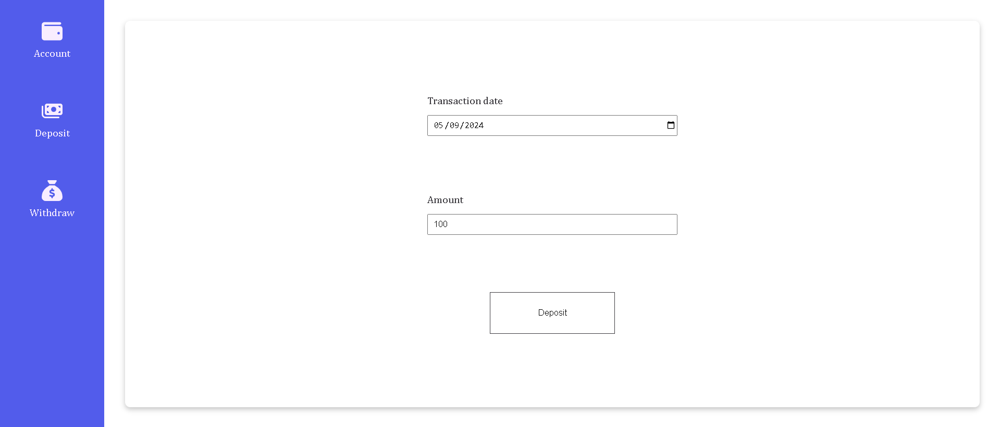
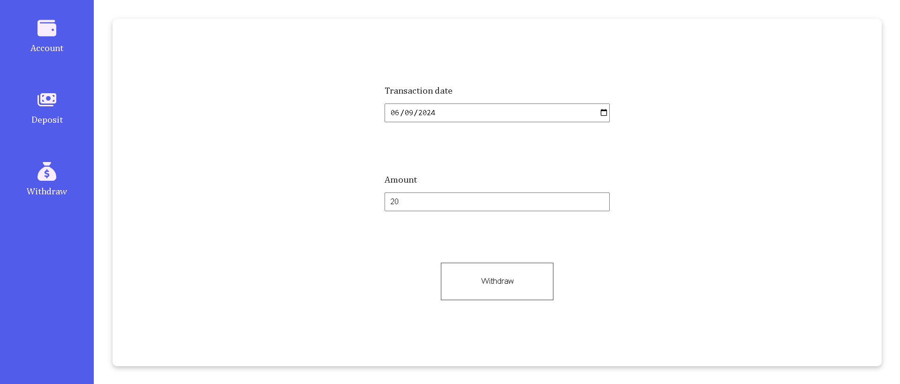
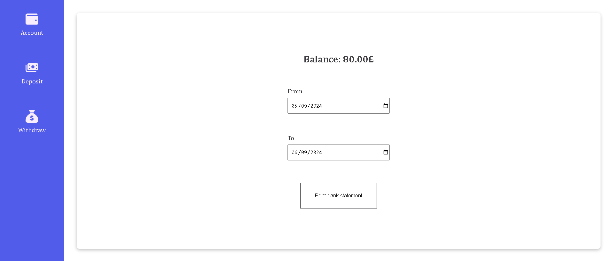
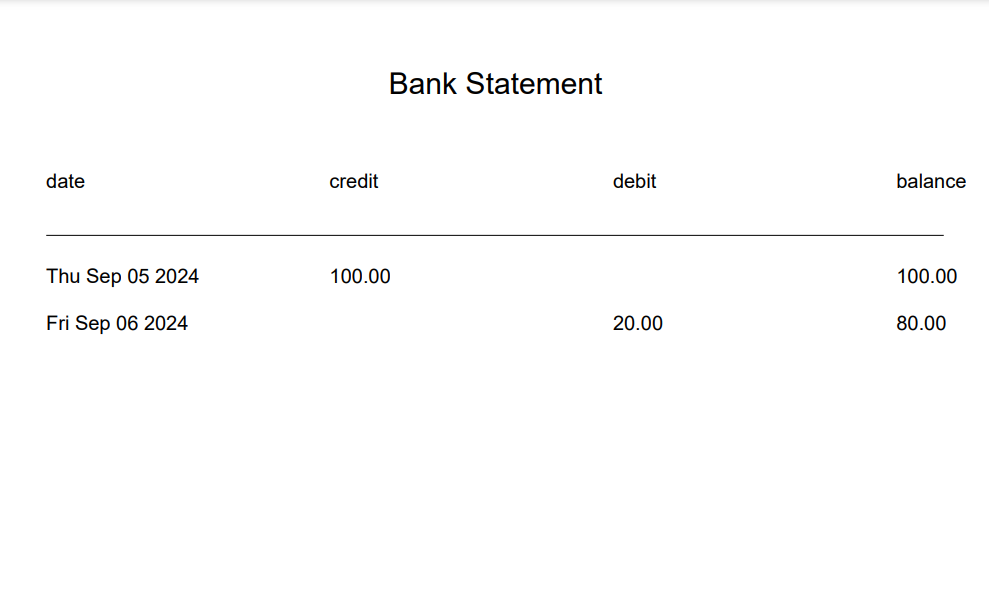

# Banking System

This project is to practice object oriented programming.

## Core

- Deposits and withdrawals
- Account statement (date, credit or debit amount, balance) printing
- Create at least one test for every function
- Ability to generate ordered bank statements between 2 dates
- Reject withdrawals if the withdraw amount exceeds the available funds. Available funds must always be calculated based on a complete transaction history, not a variable or property that gets updated
- Generate PDFs of bank statements
- A front-end online banking app

### Acceptance criteria

**Given** a client makes a deposit of 1000 on 10-01-2012  
**And** a deposit of 2000 on 13-01-2012  
**And** a withdrawal of 500 on 14-01-2012  
**When** she prints her bank statement  
**Then** she would see:

```js
date       || credit  || debit  || balance
14/01/2012 ||         || 500.00 || 2500.00
13/01/2012 || 2000.00 ||        || 3000.00
10/01/2012 || 1000.00 ||        || 1000.00
```

## Screenshots

- Deposit



- Withdraw



- Print Account Transactions



- Bank Statement in PDF


